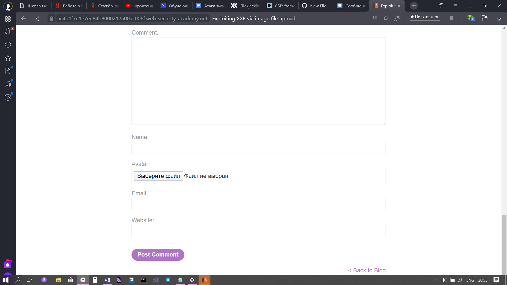
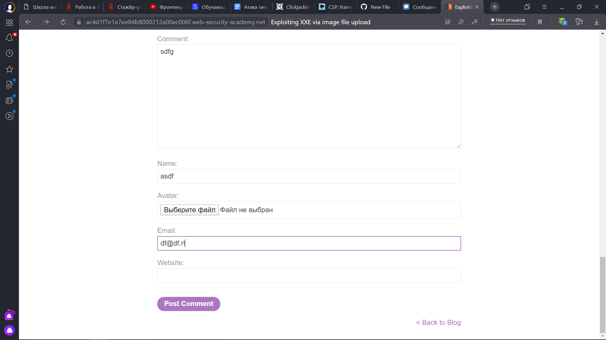
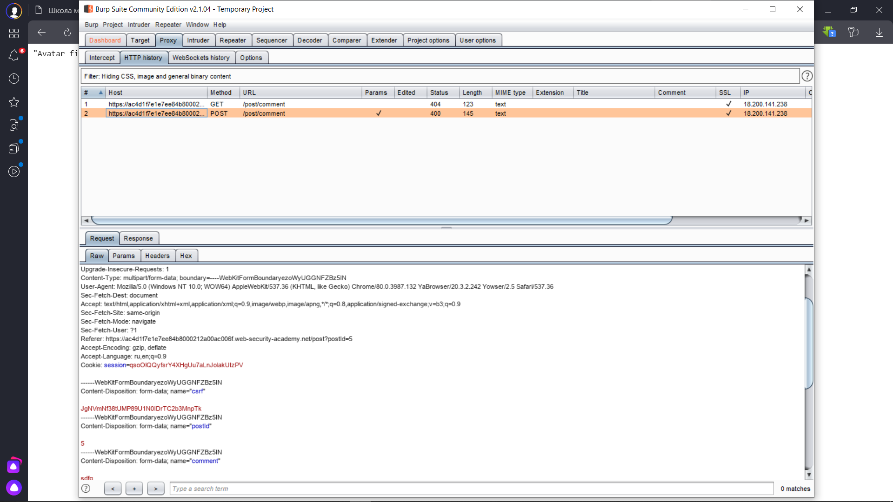
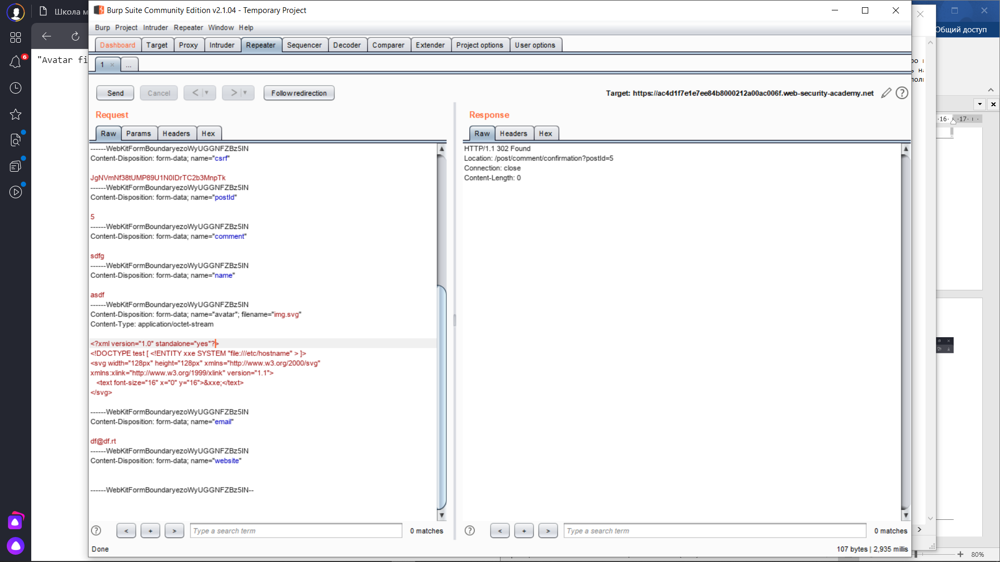
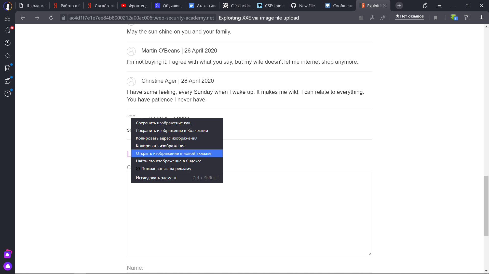
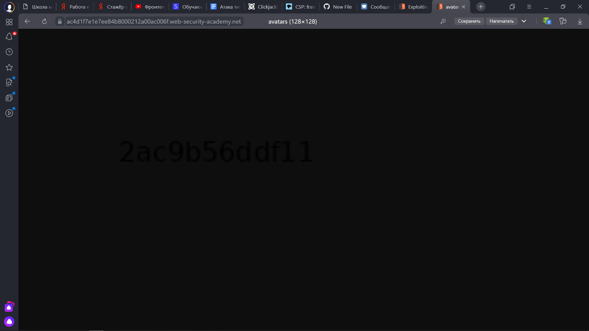
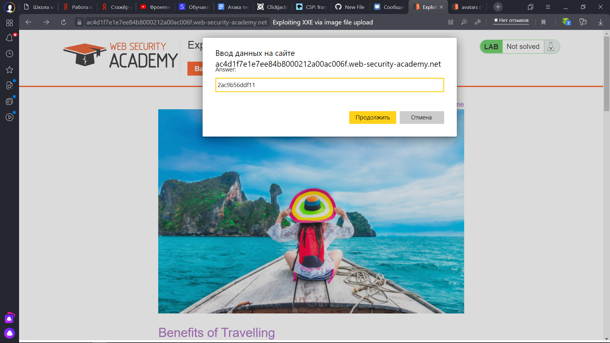

Lab: Exploiting XXE via image file upload

1) Переходим к теме и спускаемся к коментариям

2) Оставляем коммент, перехватываем и отправляем в Repeater

3) Записываем скрипт и указываем имя картинки из которой в дальнейшем будем получать данные

4) Возвращаемся на страницу с комментариями и видим картинку, открываем ее в новой вкладке

5) Вводим данный набор букв и цифр в поле ответа

6) Ура, лабораторка выполнена успешно

