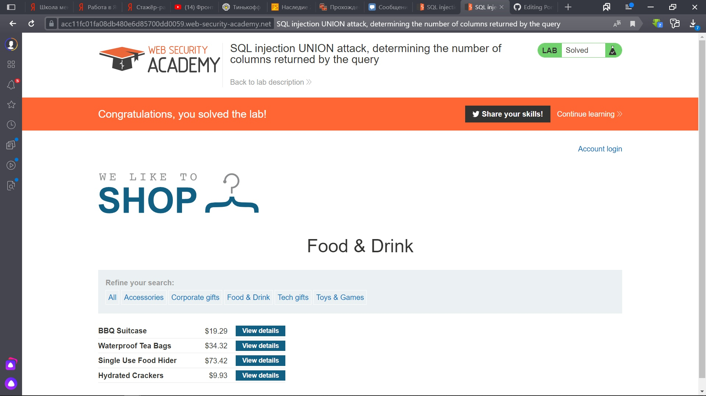
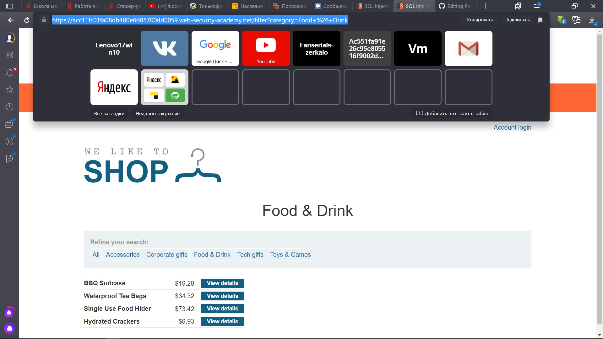
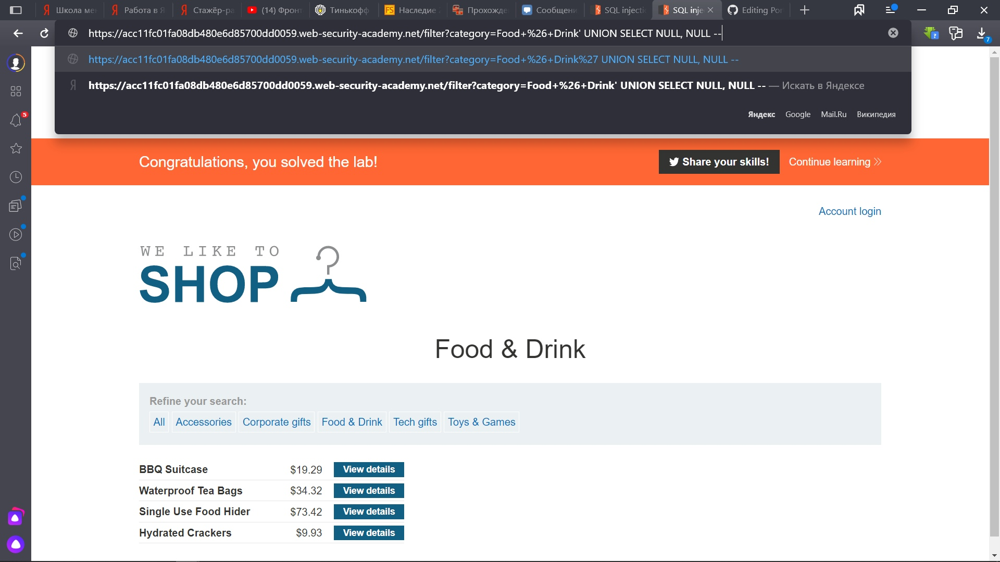
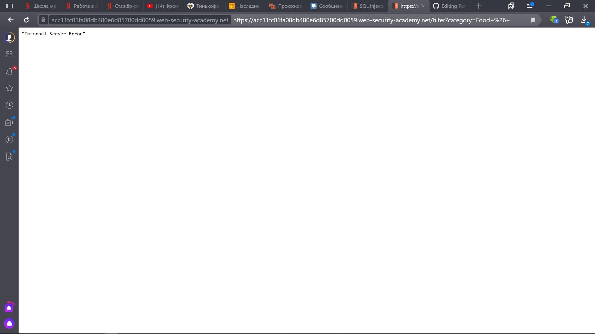
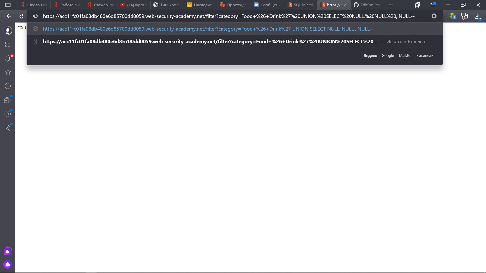
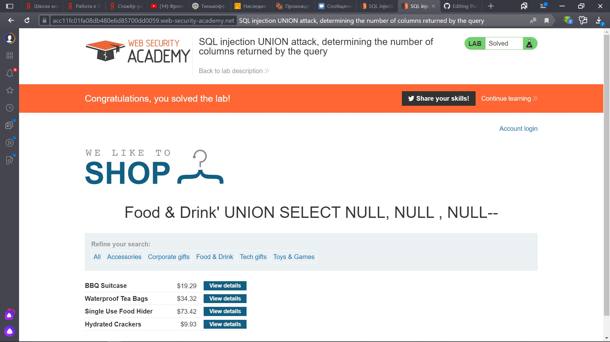

Lab: SQL injection UNION attack, determining the number of columns returned by the query

Здесь нам надо выяснить сколо таблиц в запросе.

1) Выбираем любую категорию

2) Предположим, что в запросе 2 столбца, тогда мы вводим 'UNION SELECT NULL, NULL --

3) Видим ошибку и предполагаем, что в запросе 3 столбца, вводим ' UNION SELECT NULL, NULL, NULL --

4) И у нас выводятся наши колонки, значит, в запросе 3 столбца

Аналогично можно было бы перебирать ' ORDER BY n-- (где n принимает значения 1, 2, 3 и т.д). Запросы при значениях 1, 2, 3 выполнились бы, а при значении 4 - нет => у нас в запросе три столбца и с запросом ' UNION SELECT NULL, NULL, NULL -- мы смогли бы их все вывести.
