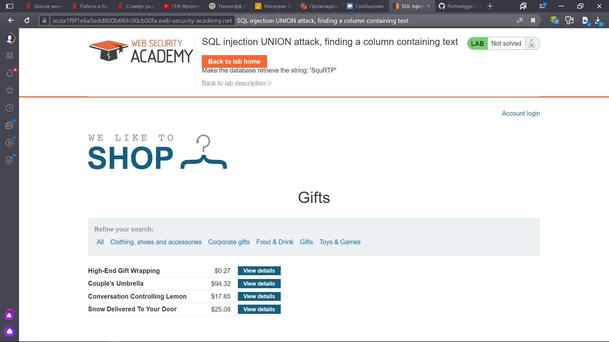
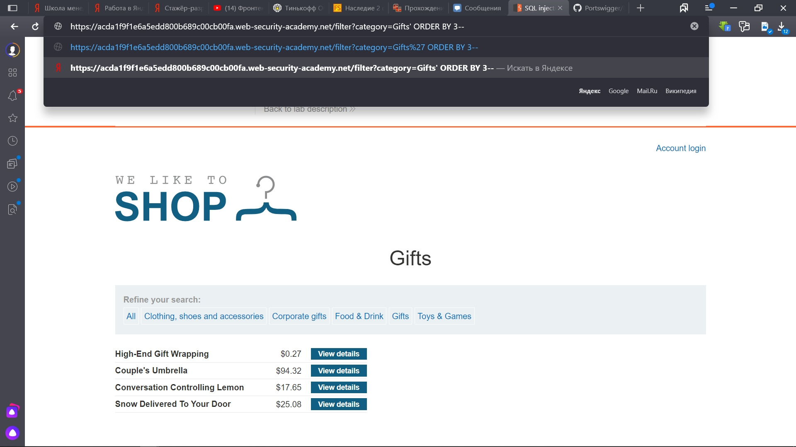
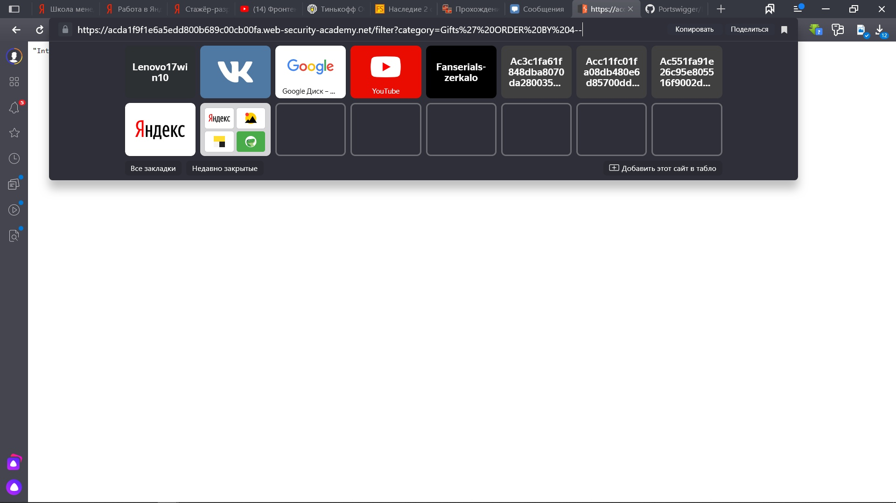
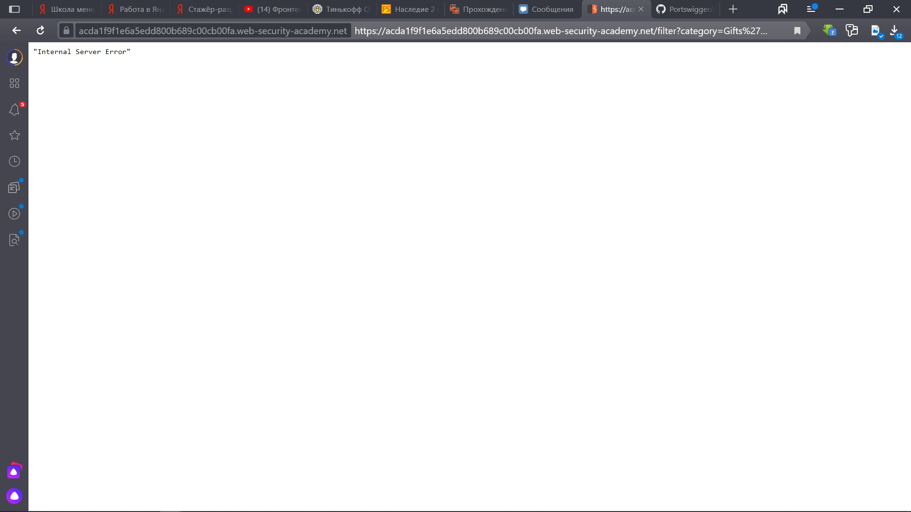
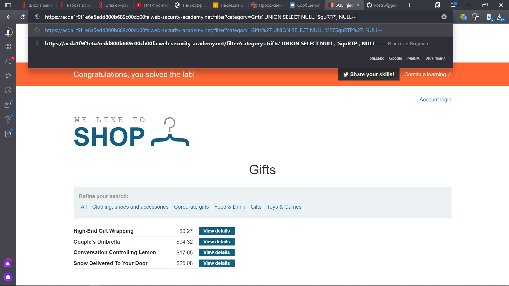
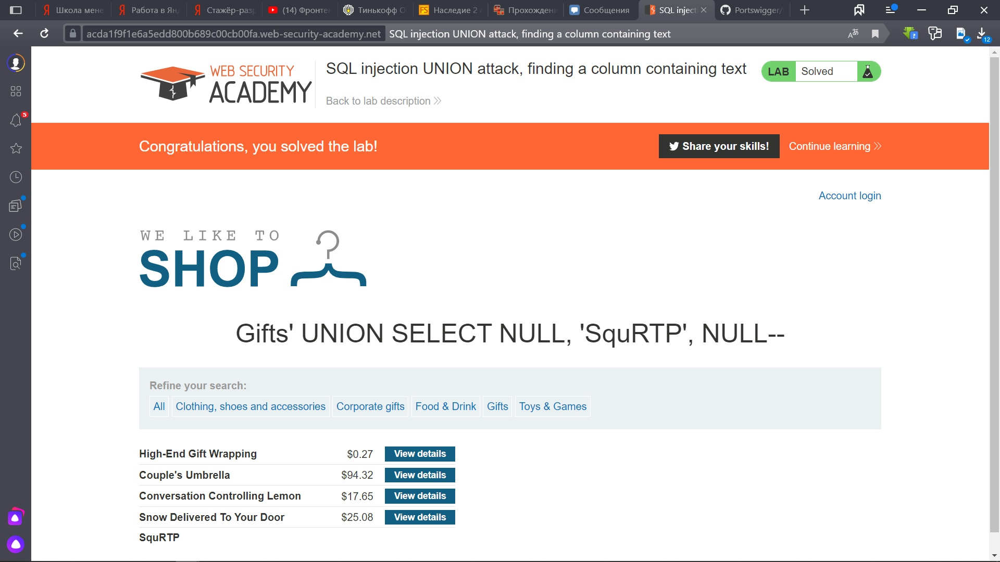

Lab: SQL injection UNION attack, finding a column containing text

Нам надо выяснить какая колонка предназначена для хранения данных в виде строки и вывести с помощью запроса в одном из столбцов 'SquRTP'

1) Попытаемся сначала выяснить количество столбцов, выбираем любую категорию и вводим GIFTS' ORDER BY 3--, запрос исполняется.

2) Заменяем в запросе тройку на четверку и видим, что произошла ошибка, значит, всего 3 столбца.

3) Зная количество столбцов, пытаемся угадать в каком содержится тип строка. Пробуем запросы:

Gifts' UNION SELECT 'SquRTP', NULL, NULL --
Gifts' UNION SELECT NULL, 'SquRTP', NULL --

4) На втором запросе получаем, что столбец со стоками - второй

