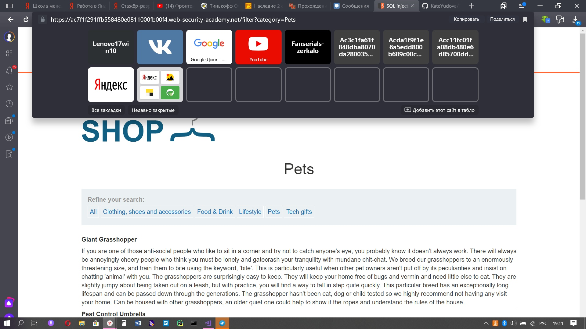
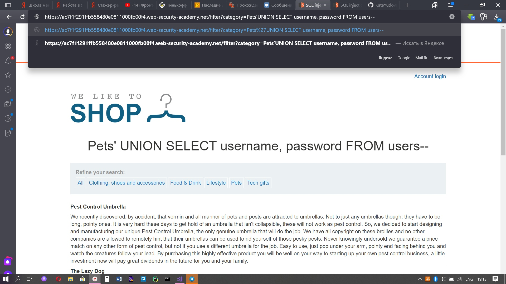
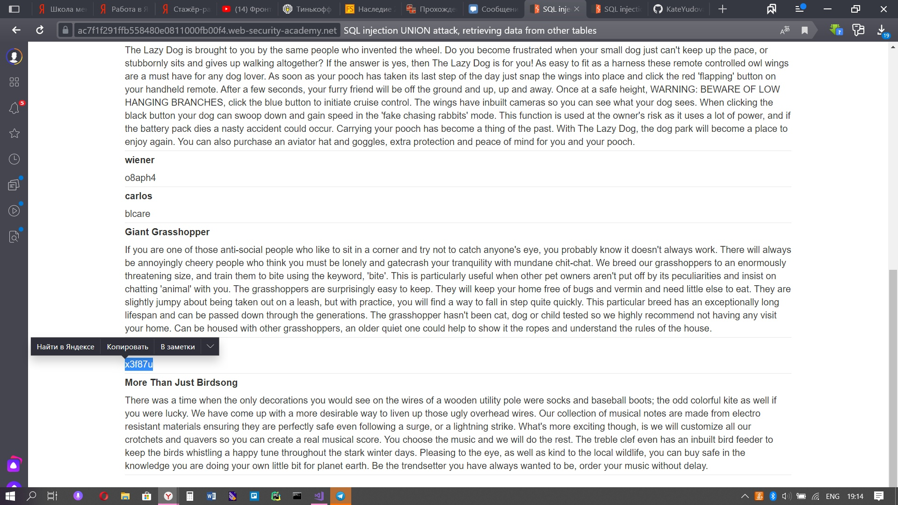
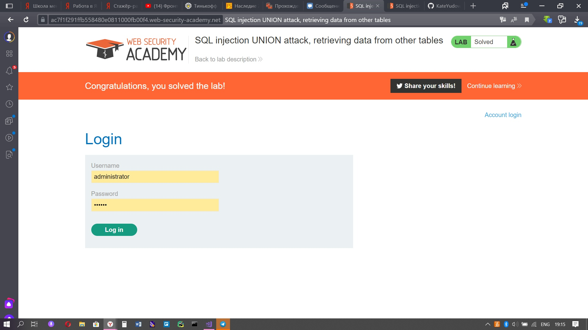

Lab: SQL injection UNION attack, retrieving data from other tables

Здесь у нас в запросе идут 2 столбца, которые содержат строки, поэтому мы можем узнать данные пользователей

1) Выбираем любую категорию и дописываем в запрос 'UNION SELECT username, password FROM users--

2) Помимо заголовков и тектов, в аналогичном формате, мы можем увидеть данные пользователей, а именно - имя и пароль

3) Копируем пароль, который соответствует пользователю с ником administrator и вставляем в поле авторизации

