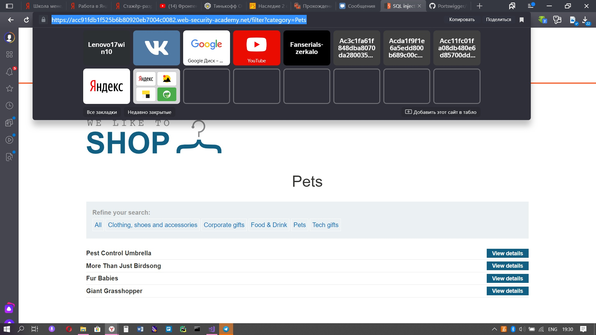
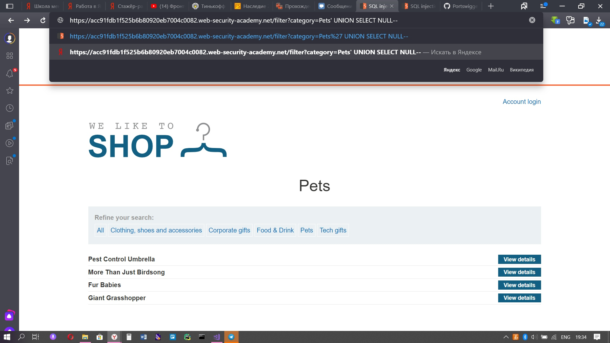
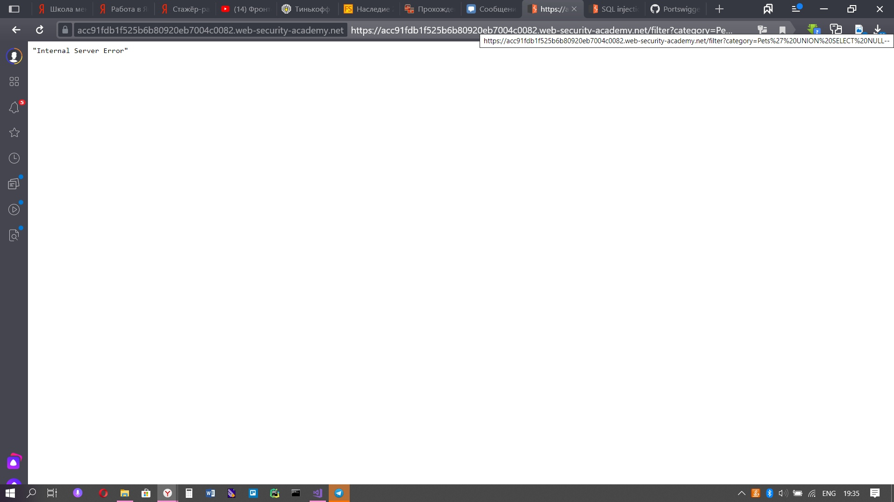
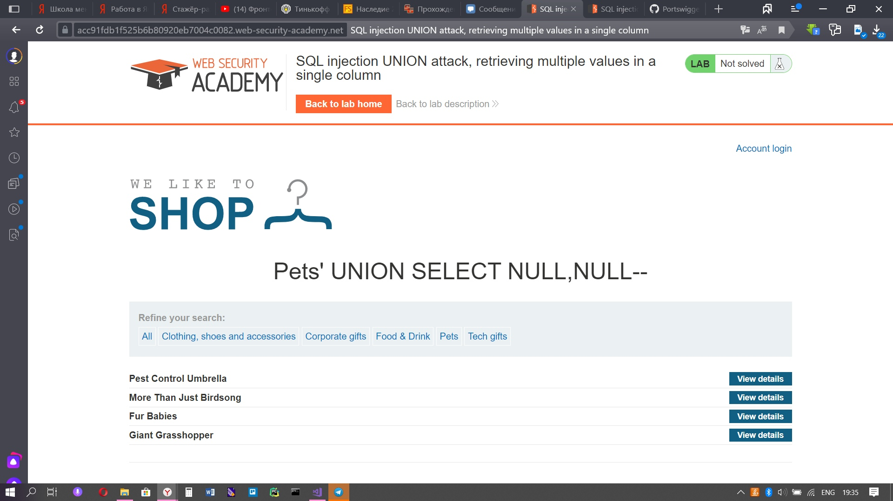
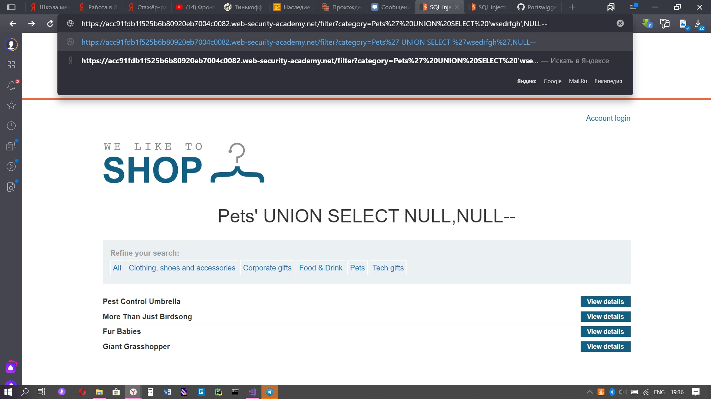
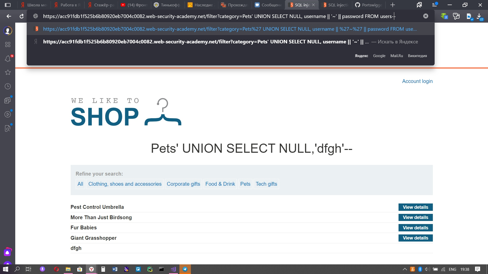
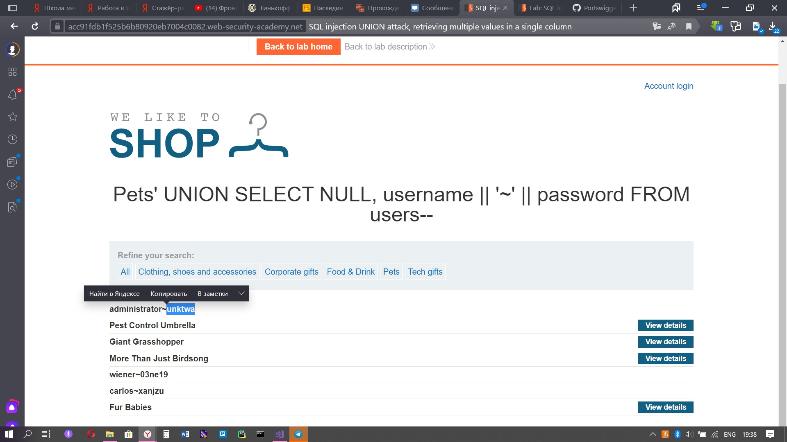
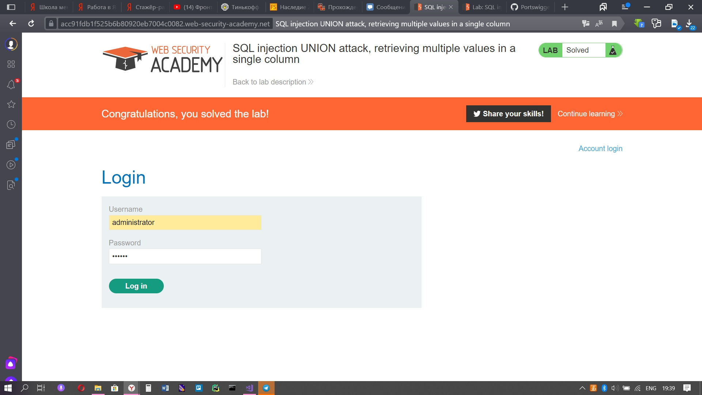

Lab: SQL injection UNION attack, retrieving multiple values in a single column

Теперь нам надо узнать пароль администратора, но только одна колонка поддерживает строчный тип

1) Открываем любую категорию и пытаемся выяснить сколько столбцов в запросе, сначала вводим 'UNION SELECT NULL--, но у нас выводится ошибка. Значит, у нас точно не один столбец.

2) Пробуем запрос с ' UNION SELECT NULL, NULL--. Ошибка не выводится, следовательно, у нас 2 столбца, осталось выяснить в каком хранится строка.

3) Предположим, что строка хранится в первом столбце, но там выходит ошибка. Следовательно, строка храниться во втором столбце.

4) Вводим запрос ' UNION SELECT NULL, username || '~' || password FROM users--

5) Находим администратора и пароль, копируем пароль и вставляем его на странице авторизации.

