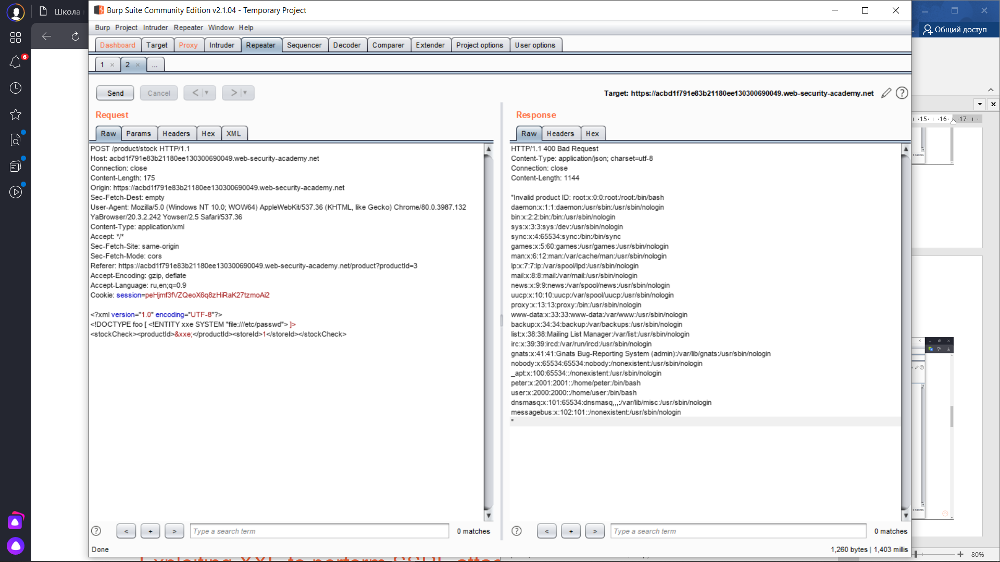

 Lab: Exploiting XXE using external entities to retrieve files
 
 1) Переходим на сайт и выбираем товар
 
 
 
 2) Включаем Burp, кликаем на кнопку "Check stock" и перехватываем запрос берпом во вкладке Proxy -> HTTP history, отправляем его в Repeater
 
 
 
 3) Изменяем запрос, вставляем обращение к сущности - файлу, который нам нужно вытащить :
 
 
 
 4) Получаем ответ:
 
 
 
 5) Видим, что лаба выполнена успешно
 
 
