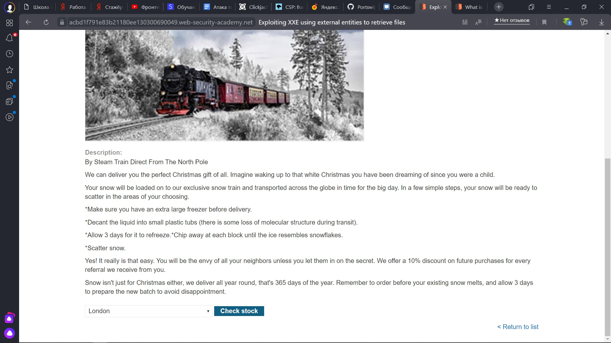

 Lab: Exploiting XXE using external entities to retrieve files
 
 1) Переходим на сайт и выбираем товар
 
 
 
 2) Включаем Burp, кликаем на кнопку "Check stock" и перехватываем запрос берпом во вкладке Proxy -> HTTP history, отправляем его в Repeater
 
 
 
 3)
 
 
 
 
