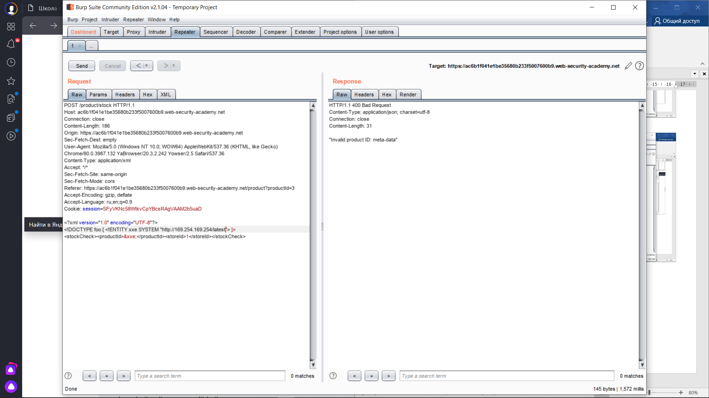
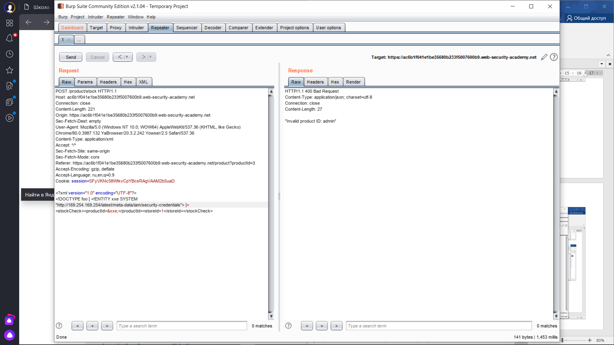
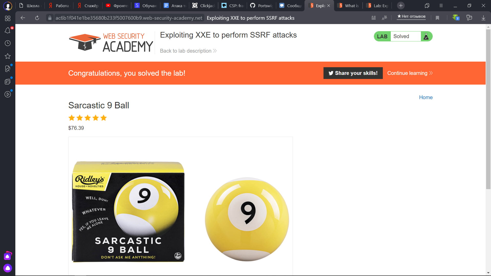

 Lab: Exploiting XXE to perform SSRF attacks
 
 1) Включаем Burp, включаем сайт и нажимаем кнопку "Check Stock" и перехватываем запрос, отправляем его в Repeater
 
 
 
 
 2) Добавляем в запрос строчку, которая обратится к нашей сущности по адресу 169.254.169.254
 
 
 
 3) По этому адресу хранится "latest", зайдем в эту директорию и будем постепенно добираться до нужной нам сущности
 
 
 
 
 4) Получаем нужную нам сущность
 
 
 
 5) Ура, лабораторка решена
 
 
