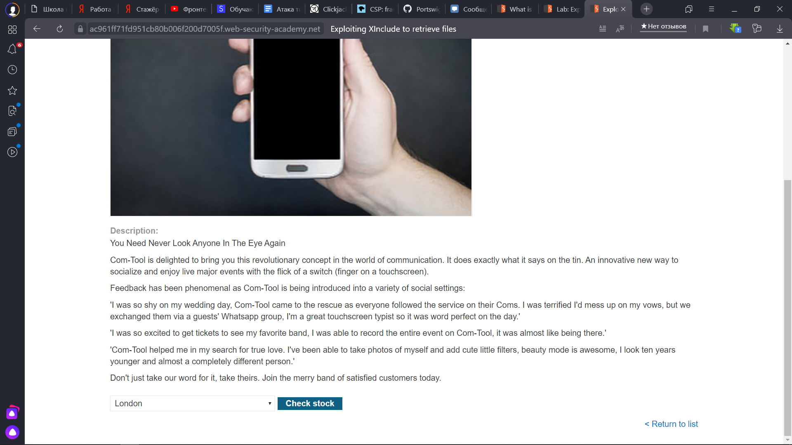
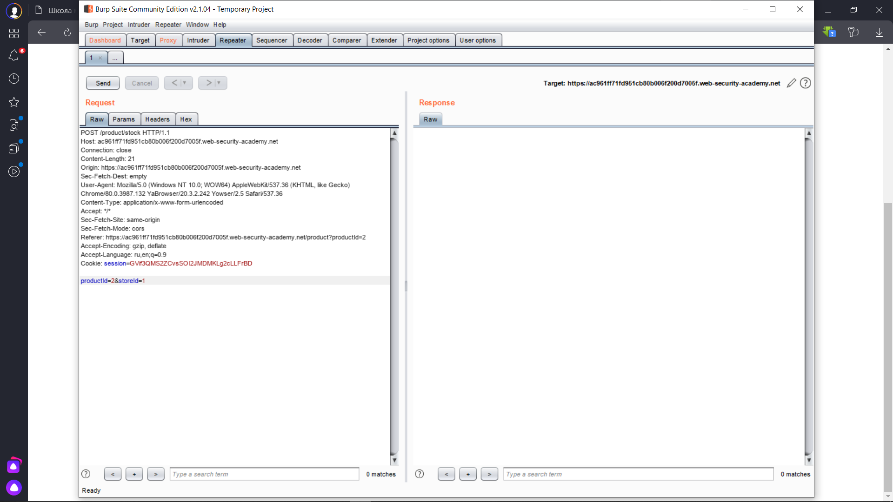
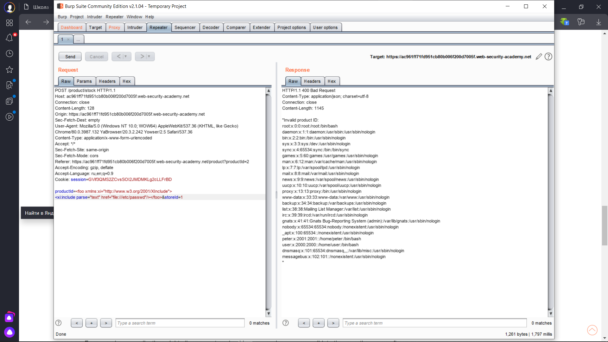
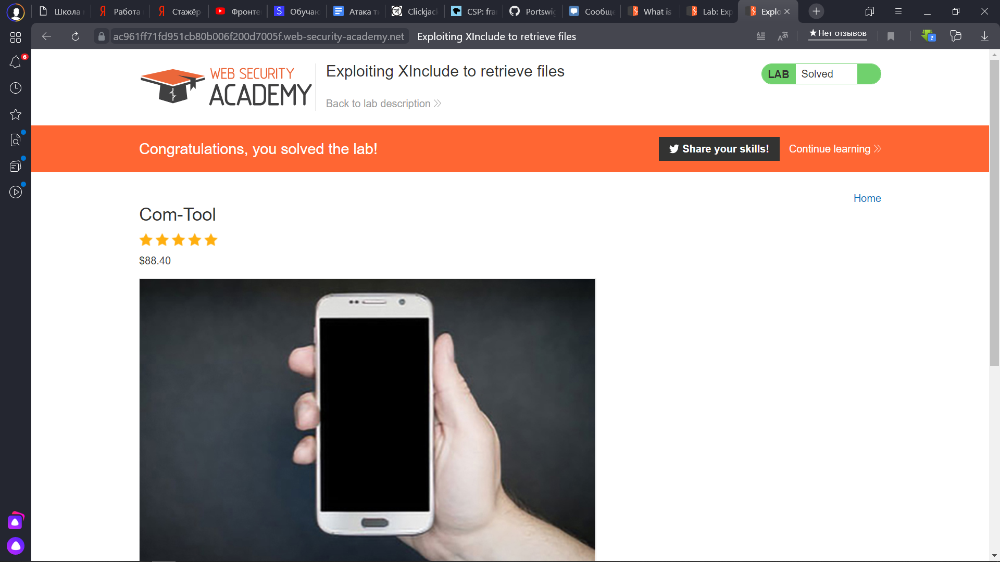

 Lab: Exploiting XInclude to retrieve files
 
 1) Открываем Burp, заходим на сайт, нажимаем на кнопку и перехватываем запрос
 
 
 
 2) В этот раз не получится использовать DOCTYPE, т.к. нет специального заголовка, после которого мы его всегда использовали, поэтому будем действовать по-другому
 
 
 
 3) Расширяем наш неймспейс с помощью специального скрипта, который размещаем в запросе, который обращается к данным
 
 
 
 4) Ура, мы успешно выполнили лабу
 
 
